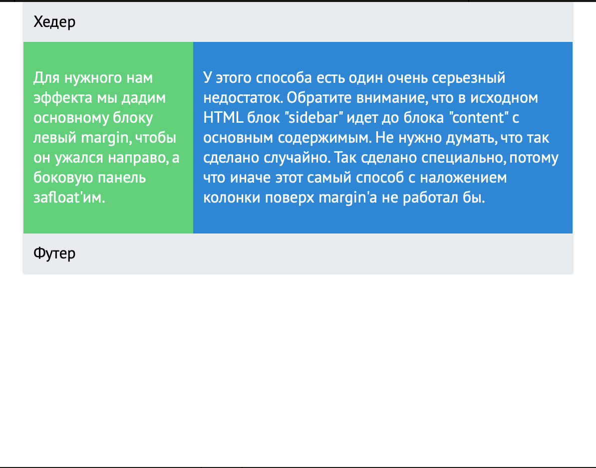

## Сетки и <code>float</code>

Код <a href="https://jsfiddle.net/GreatRaksin/wnhLq2jk/1/" target="_blank">здесь</a>.

Необходимо составить сетку так, чтобы страница выглядела так же, как на картинке:

